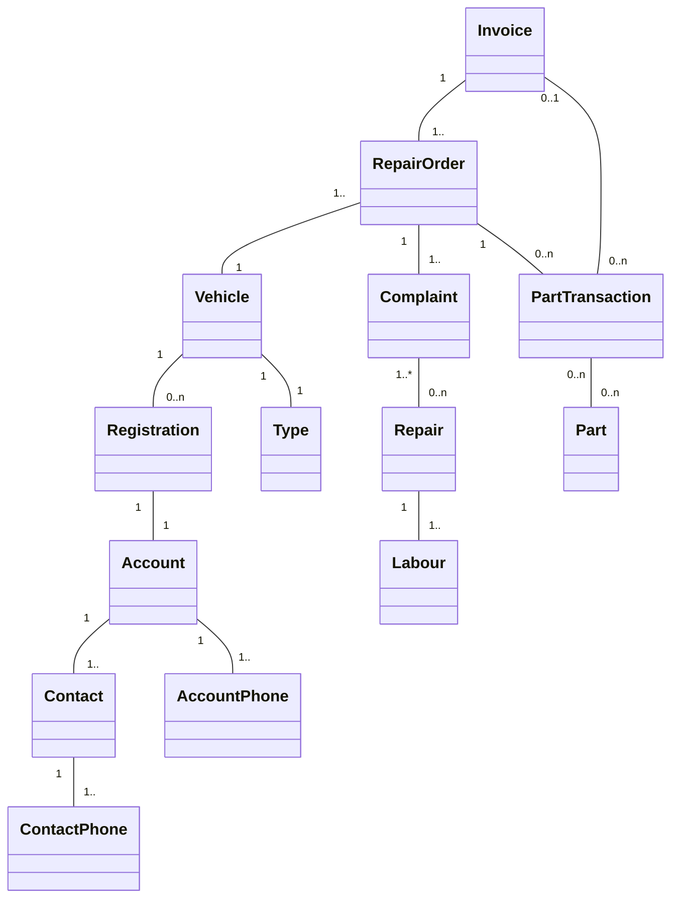

# Automotive Dealership Management System

## Mission Statement

To create automotive dealership/workshop system that will run on all major platforms and provide access to all functionality and data through web based application.

## Features

- (in progress) Repair management
- (in progress) Spareparts management
- (in progress) Accounts and contacts management

## Requirements

- Web server
- PHP
- MySQL
- CakePHP 1.3.6 or higher

## Class Diagram

